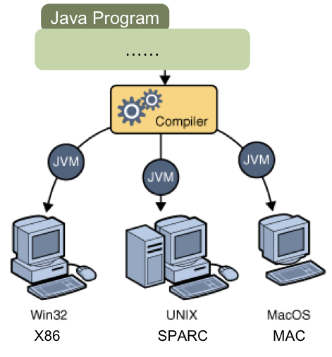

# Java程序设计


<small>曹春 caochun@gmail.com</small>

<small> 余萍 yuping.nju@gmail.com</small>

---

<!-- .element width="45%" height="80%" -->

---

## 课程网站


- 仓库：https://github.com/njuics/java-2017f
- 页面： https://njuics.github.io/java-2017f
- 作业：https://github.com/njuics/java-2017f-homework

<!-- .element height="30%" width="30%" --> 

---

## 目录（WWW）

- **W**hy - 为什么要学Java？

- **W**hat - 什么是Java？

- Ho**w** - 怎么学Java？

---

## Java之父

 <!-- .element height="65%" width="50%" --> 

James Gosling


---

## 历史

- 1990，Oak，家用电器等小型系统的程序语言
- 1995，Java发布，互联网编程语言, HotJava

---

## HotJava

  <!-- .element height="80%" width="80%" --> 

---

## Java SDK


- JDK 1.02 (1995)
- JDK 1.1 (1996)
- Java 2 SDK v 1.2 (a.k.a JDK 1.2, 1998)
- Java 2 SDK v 1.3 (a.k.a JDK 1.3, 2000)
- Java 2 SDK v 1.4 (a.k.a JDK 1.4, 2002)
- ...
- Java 8 SDK (current) <small>http://www.oracle.com/technetwork/java/javase/downloads/index.html</small>
- Java 9 SDK （coming ...)

---

## JDK Editions

- Java Standard Edition (J2SE)
  - J2SE can be used to develop client-side standalone applications or applets.
- Java Enterprise Edition (J2EE)
  - J2EE can be used to develop server-side applications such as Java servlets and Java ServerPages. 
- Java Micro Edition (J2ME). 
  - J2ME can be used to develop applications for mobile devices such as cell phones. 


---

## Java特性

- Simple
- Object Oriented
- Interpreted
- Secure
- Architecture-neutral
- Portable
- ...

---

## JVM



---


## Java IDE （Dead）

- IBM Visual Age for Java 
- Microsoft Visual J++
- Borland JBuilder
- Forte by Sun MicroSystems 

---

## Java IDE


- NetBeans https://netbeans.org/

- Eclipse http://eclipse.org/

- IDEA by IntelliJ https://www.jetbrains.com/idea/

---


## 教材

 <!-- .element height="60%" width="40%" --> 


---

## Hello World

```Java
//This is my first java program. 
package njuics.java2017;

public class HelloWorld {	
  public static void main(String[] args) { 
    System.out.println("Hello World!");
  }
}
```

---

### 安装配置

<small>https://docs.oracle.com/cd/E19182-01/820-7851/inst_cli_jdk_javahome_t/</small>

### 编译

```bash
javac HelloWorld.java
```


### 运行

```bash
java HelloWorld
```


---

## 上册

1. 语言基础 (`Introduction`, `Primitives`, `Operators`, `Controlling Exection`)
2. 面向对象 （`Introdction to Objects`, `Everything is an Object`, `Initialization & Cleanup`)
3. 面向对象 (`Access Control`, `Resuing Classes`)
4. 面向对象 (`Interfaces`, `Polymorphism`, `Inner Classes`)
5. Desigin by Contract & UML 🚺


---

## 中册

6. 异常处理 (`Error Handling with Exceptions`) 🚺
7. 类加载和自省
8. 工具 (`Holding your objects`, `Strings`, `Arrays`) 🚺
9. 类型 (`Type Information`, `Generic`, `Container in Depth`)
10. 标注和测试（`Annotations`/Testing）
11. 工程工具（Maven/Gradle/CI）

---

## 下册

12. 输入输出（`I/O`） 🚺
13. 并发编程（`Concurrency`）
14. 图形化（`GUI`） 🚺
15. 设计（Design Pattern） 🚺
16. Java框架（Components, IoC, MVC）

---

# END