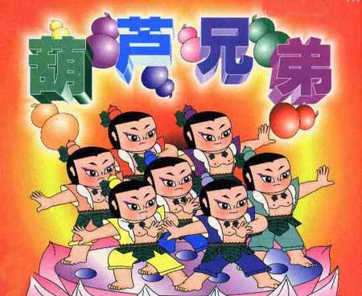
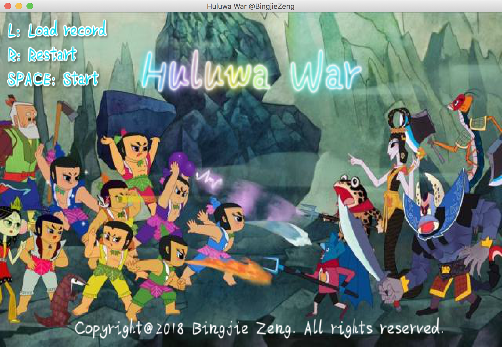
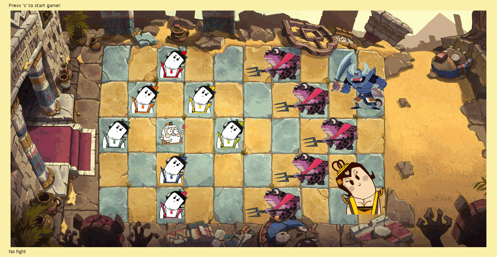
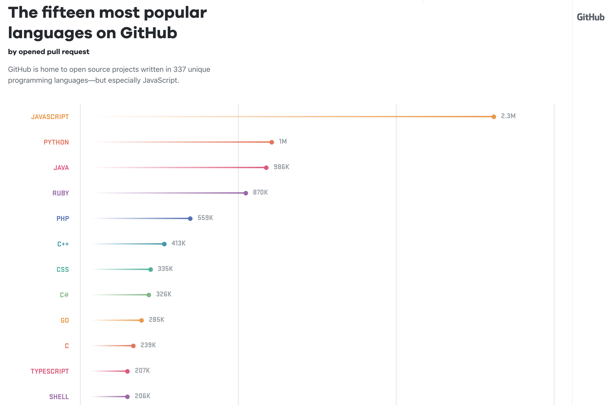
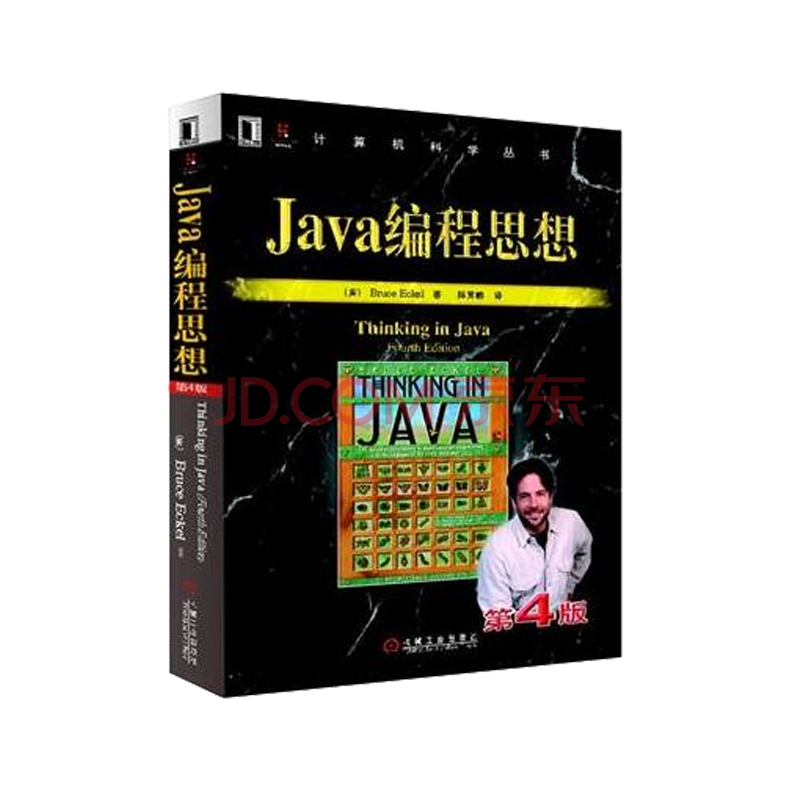

# Java程序设计


<small>曹春 caochun@gmail.com</small>

<small> 🚺余萍 yuping.nju@gmail.com</small>

---

## Java

又一门高级程序设计语言。

---

## 为什么（又）要学Java？

- 缺学分
- 找工作
- 交朋友
- ...
  
---

## 缺学分的，这课不适合你

- 去年
  - 选课：150人（名单：170人，退选：20人）
  - 及格：106人（70.6%）
  - 100~90：11人(7.3%)；90～80：30人(20%)；80~70:43人(28.7%)；70~60：22人(14.7%)
  
---

## 作业又多又难



葫芦娃系列作业

<small>https://github.com/njuics/java-2017f-homework</small>

---

## 大作业遭到控诉

葫芦娃大战妖精

  - <small>开发一个展现葫芦娃与妖精大战的图形化应用</small>
    - <small>绘制一个NxM的二维空间（N和M足够大，空间左上角为原点，向右向下分别为X轴和Y轴正方向），该空间中的任意一个位置坐标上可且仅可站立一个生物体（葫芦娃、老爷爷、蛇精、蝎子精、小喽啰均属于生物体）；</small>
    - <small>请让七个兄弟和老爷爷以下图中的某种阵型在空间的左侧战队；请让妖精（蛇精、蝎子精、小喽啰）以下图中的某种阵型在空间右侧战队；</small>
    - <small>以上各生物体均实现为一个线程（注：此处要求大家用线程是为了验证各位是否掌握了多线程并发编程，实际上GUI应用中应该用Swing Timer来进行UI刷新）；</small>
    - <small>按空格键时所有生物体线程执行start()，向敌方前进；</small>
    - <small>当某个生物体于敌方相遇（两者间的X轴距离和Y轴距离小于某个常量）时，选取一个概率决定双方生死，死者留下实体，生者寻找下一个敌人攻击；</small>
    - <small>某一方生物全部死亡时，结束。</small>

---

## 也有挺过来的

<!-- .element width="80%" height="65%" -->

---

## 也有挺过来的



---

## 也有挺过来的

<!-- .element width="65%" height="65%" -->

---

## 找工作的，这课不是很适合你

<!-- .element width="65%" height="65%" -->

目前看来，学JS、Python才是王道

---

## WHY

> java作为第一大语言主要用来做什么?他有什么优势导致这种现象？


https://www.zhihu.com/question/54880498

---

## 前导课程要求

** 至少一门高级程序设计语言 **

如果C++学得很好，特别是面向对象编程思想领悟到位，建议不选（但不接受免修不免考）。

---

## Java相关课程（后续）

- 软件工程综合实验
- 大数据综合实验
- 软件体系结构
- 面向对象技术
- ...

---

## 交朋友的，加个QQ


<!-- .element width="45%" height="80%" -->

---

## 课程网站


- 仓库：https://github.com/njuics/java-2018f
- 页面： https://njuics.github.io/java-2018f
- 作业：https://github.com/njuics/java-2018f-homework

<!-- .element height="30%" width="60%" --> 

---

## Java之父

 <!-- .element height="65%" width="50%" --> 

James Gosling

---

## 历史

- 1990，Oak，家用电器等小型系统的程序语言
- 1995，Java发布，互联网编程语言, HotJava

---

## HotJava

  <!-- .element height="60%" width="60%" --> 

---

## Java SDK

- JDK 1.02 (1995)
- JDK 1.1 (1996)
- Java 2 SDK v 1.2 (a.k.a JDK 1.2, 1998)
- Java 2 SDK v 1.3 (a.k.a JDK 1.3, 2000)
- Java 2 SDK v 1.4 (a.k.a JDK 1.4, 2002)
- ...
- Java 8 SDK (current)
- Java 9 SDK
- Java 10 SDK （current)
  
<small>http://www.oracle.com/technetwork/java/javase/downloads/index.html</small>

---

## JDK Editions

- Java Standard Edition (J2SE)
  - J2SE can be used to develop client-side standalone applications or applets
- Java Enterprise Edition (J2EE)
  - J2EE can be used to develop server-side applications such as Java servlets and Java ServerPages
- Java Micro Edition (J2ME)
  - J2ME can be used to develop applications for mobile devices such as cell phones


---

## Java特性

- Simple
- Object Oriented
- Interpreted
- Secure
- Architecture-neutral
- Portable
- ...

---

## JVM


---

## Java IDE （Dead）

- IBM Visual Age for Java
- Microsoft Visual J++
- Borland JBuilder
- Forte by Sun MicroSystems

---

## Java IDE

- NetBeans https://netbeans.org/

- Eclipse http://eclipse.org/

- IDEA by IntelliJ https://www.jetbrains.com/idea/

---


## 教材

 <!-- .element height="65%" width="40%" --> 

The forth edition，1400+ pages

---

## Hello World

```Java
//This is my first java program. 
package njuics.java2018;

public class HelloWorld {
  public static void main(String[] args) {
    System.out.println("Hello World!");
  }
}
```

---

### 安装配置

<small>https://docs.oracle.com/cd/E19182-01/820-7851/inst_cli_jdk_javahome_t/</small>

### 编译

``` bash
javac HelloWorld.java
```

### 运行

``` bash
mv HelloWorld.class njuics/java2018
java njuics.java2018.HelloWorld
```


---

## 上册

1. 语言基础 (`Introduction`, `Primitives`, `Operators`, `Controlling Exection`)
2. 面向对象I （`Introdction to Objects`, `Everything is an Object`, `Initialization & Cleanup`)
3. 面向对象II (`Access Control`, `Resuing Classes`)
4. 面向对象III (`Interfaces`, `Polymorphism`, `Inner Classes`)
5. Desigin by Contract & UML 🚺


---

## 中册

6. 异常处理 (`Error Handling with Exceptions`) 🚺
7. 类加载和自省
8. 工具 (`Holding your objects`, `Strings`, `Arrays`) 🚺
9. 类型 (`Type Information`, `Generic`, `Container in Depth`)
10. 标注和测试（`Annotations`/Testing）
11. 工程工具（Maven/Gradle/CI）

---

## 下册

12. 输入输出（`I/O`） 🚺
13. 并发编程（`Concurrency`）
14. 图形化（`GUI`） 🚺
15. 设计（Design Pattern） 🚺
16. Java框架（Components, IoC, MVC）

---

# END